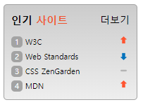

# sprite를 활용한 인기 사이트 구현

> 마크업
```
  <ol class="favoriteList">
    <li class="favoriteRank sprite sprite1">
      <a href="https://www.w3.org/"><span class="rankNum">1</span> W3C</a>
    </li>
    <li class="favoriteRank sprite sprite2">
      <a href="https://www.webstandards.org/"><span class="rankNum">2</span> Web Standards</a>
    </li>
    <li class="favoriteRank sprite sprite3">
      <a href="https://www.csszengarden.com/"><span class="rankNum">3</span> CSS ZenGarden</a>
    </li>
    <li class="favoriteRank sprite sprite4">
      <a href="https://developer.mozilla.org/"><span class="rankNum">4</span> MDN</a>
    </li>
  </ol>
```
\- 랭크는 순서가 정해진 리스트이므로 ol태그를 이용해서 마크업.
\- 랭크 순위를 span태그에 rankNum 클래스를 이용해 꾸며 나타냄.

> CSS
```
.sprite {
  background: url(assets/rank.png) no-repeat;
  background-position: right 0;
}
.sprite2 {
  background-position: right -42px;
}
```
\- li인 sprite 클래스에 background-image를 활용해 랭크 이미지를 나타냄.
\- background-position에서 x축을 right을 함으로써 오른쪽 끝에 배치. 각각의 li의 y축을 다르게 함으로써 이미지 변경.

```
.favoritMore {
  font-size: 0.875rem;
  position: absolute;
  top: 0.75rem;
  right: 0.625rem;
}
```
\- 상위요소인 favoriteContainer 클래스인 div에 position:relative;를 주고 버튼인 .favoritMore에 position: absolute;과 top, right를 활용해 오른쪽 상단에 나타냄.


## Result
